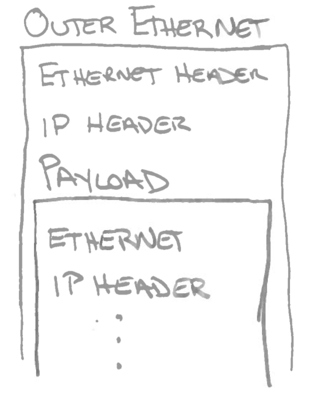
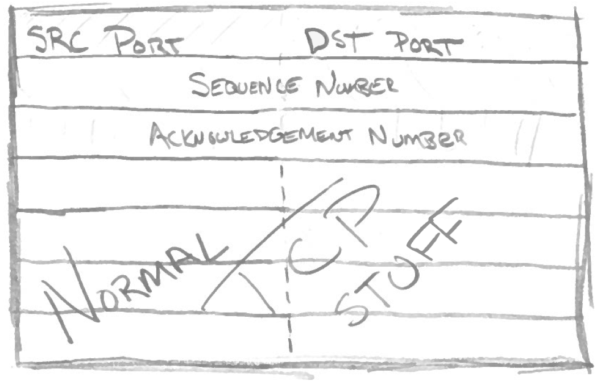

# Cloud Tunnels

<!--
Often when using a collection of cloud servers it is nice to have a
private network between your own machines. But, how does a cloud
provider create a multi-tenant network where everyone has there own
private network on demand? This talk will explore the technologies
involved in creating multi-tenanted networks and why the new tunneling
protocols like NVGRE, VXLAN, and STT provide "privacy" but not security.

http://networkheresy.com/2011/10/03/nvgre-vlxan-and-what-microsoft-is-doing-right/

http://networkheresy.com/2011/08/31/vxlan-moving-towards-network-virtualization/

http://blog.ioshints.info/2011/08/finally-mac-over-ip-based-vcloud.html

http://blogs.cisco.com/datacenter/vxlan-deep-dive-part-2-looking-at-the-options/
-->

## Background

- Currently part of Cloud Monitoring at Rackspace
- Previously at SuSE on Kernel team on Ethernet networking
- Saw a talk at Linux Plumbers Conference (Tunneling Monster)
 

## What are cloud networks?

<!--
Consequence of transparency is that we end up presenting a virtual
ethernet to the virtual machine
-->

- Transparency to the cloud machine
- Multiple tenants on a single network
- Networks can't see/talk to each other

## Networking is about layers

<!--
L1. Ethernet header on top
L2. IP header below that
L3. Application (TCP/UDP/etc) traffic below
-->

## Not entirely accurate

<!--
Joke: Ethernet is actually a header and trailer, maybe a clam.
-->

## Don't we already have VLANs (IEEE 802.1Q)

- An extension to ethernet frames
- 12 bits of VLAN ID, only 4096 (tenant)
- Requires physical switch participation
  - Lots of different hardware to configure
  - Hard to do quickly on-demand
- Conclusion: Built for a different era

## L2 in L3 tunneling to the rescue

- You want a private L2 network between VMs
- You already have working IP between the members of the network
- Use that "underlay" IP network and overlay an L2 on top

## L2 in L3

## What does it looks like in boxes

## Three contenders

- VXLAN
- NVGRE
- STT

## VXLAN (VMWare/Cisco/Broadcom/Red Hat)

<!--
Users a protocol very similar to Overlay Transport Virtualization
http://blogs.cisco.com/datacenter/vxlan-deep-dive-part-2-looking-at-the-options/
-->

- Virtual eXtensible Local Area Network
- Encapsulates in a UDP packet
- 24 bits of tenant space (16 million)
- http://tools.ietf.org/id/draft-mahalingam-dutt-dcops-vxlan-02.txt

## NVGRE (Microsoft/HP/Intel/Broadcom)

- Network Virtualization using Generic Routing Encapsulation
- Uses the GRE which 
- 24 bits of tenant space (16 million)
- http://tools.ietf.org/id/draft-sridharan-virtualization-nvgre-01.txt

## STT (Nicira)

- Stateless Transport Tunneling
- Uses a "cute" hack to get performance from network gear
  - Use the TCP header "syntax"
  - Take advantage of hardware TCP offload on existing server hardware
- Large 64 bit context id (16 million)
- http://tools.ietf.org/id/draft-davie-stt-02.txt

## STT Example Header

<!--
This is just a TCP header. The source port should remain contanst throughout a TCP flow and destination port should stay in the IANA range.

SEQ and ACK	 are used for special purpose. Otherwise it is a normal TCP header.
-->

## STT Example Explained

<!--
Since the SEQ number is an increasing sequence still despite changing semantics
LRO still works, cool.
-->

- ACK is used as an identification field
- SEQ upper is used for STT frame length
- SEQ lower is used for STT frame offset of this packet 

## STT is a cool hack! But...

- Firewalls inspecting L3 traffic will be grumpy
- Could confuse the network in the middle

## What about broadcast/multicast

- Essentially all standards rely on IP multicast
- Mapping of virtual network to multicast group is left undefined
- Out of scope for these tunneling protocols

## So what is the payoff

- Multicast between virtual machines
- Less burden on 100% secure firewalls
- Can be built in a secure manner
- Much more sophisticated attacks required

## Security of L2 in L3 Tunneling

<!--
Imagine all of the security considerations if you allowed 
All of these RFCs acknowledge that 
-->

- VM ethernet can be spoofed and inspected by any attacker at the IP level
- Virtual Network ID must be properly communicated automically without reuse
- All three RFCs recommend considering IPSec

## Useful cases to increase security

- Keep backend servers off of public IPs
- Running old insecure OSes for building packages
- Creating isolated dev/qe machines environments

## Don't trust your providers L2?

Still pragmatic to secure your services with SSl/TLS/IPSec

## Take aways

- Open vSwitch implements GRE already
- Code exists for NVGRE for Open vSwitch
- STT is implemented in vSwitch but closed source (Nicira)
- L2 in L3 is probably here to stay in the cloud
- In its raw form these protocols give a level of privacy but not security
- You should still use SSL/IPSec/etc between backend services